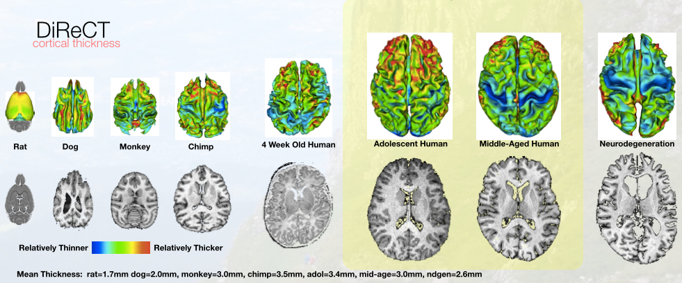
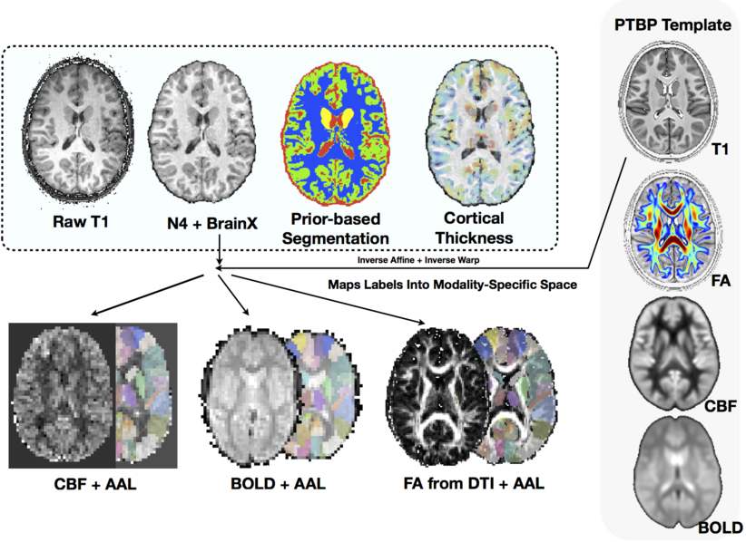
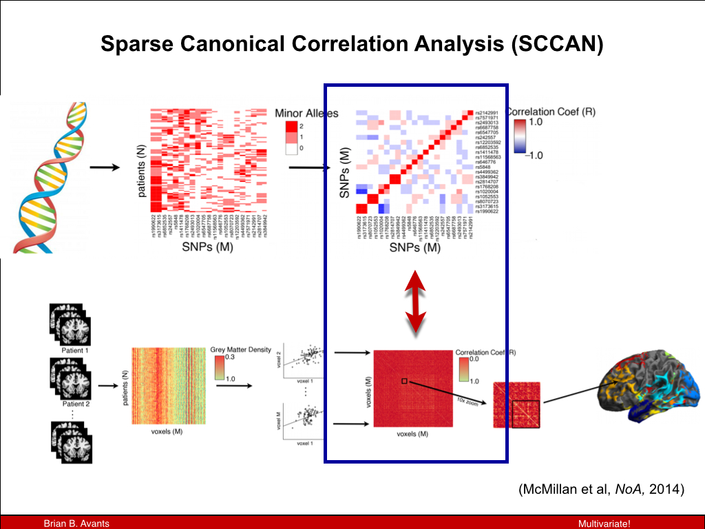
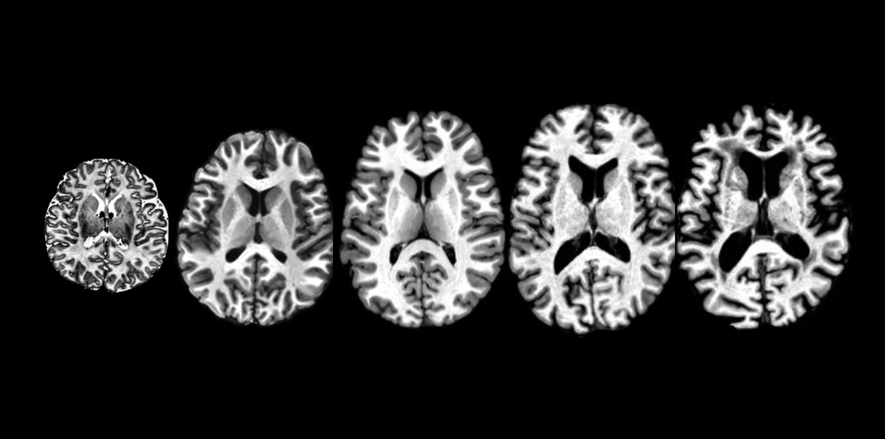
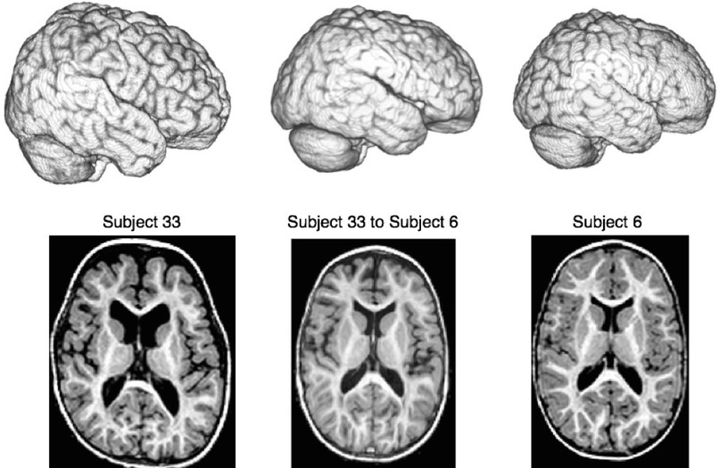
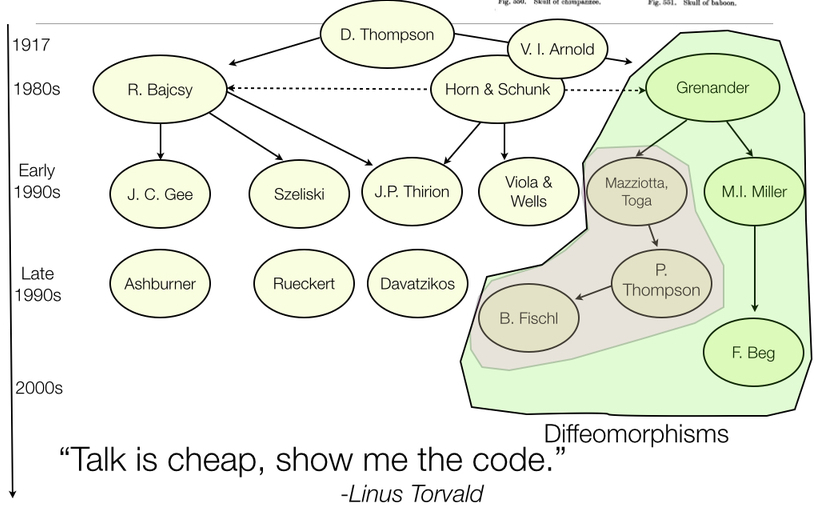

# Background

Differentiable maps with differentiable inverse

Multivariate segmentation & registration

High-dimensional statistics in low-dimensional spaces

# General theory tunable to specific domains:  *no-free lunch*

##

# Use prior knowledge to broaden performance

##

# Library for multivariate image registration, segmentation & statistics

##

##

# *ITK+ANTs+R = ANTsR*

##

## How do we quantify _life span_ brain health in individuals and in populations?

## How do we integrate modalities and organ systems?

need unbrain example here

## ANTs*R* $\rightarrow$ new insight via quantification

Good software should fade into the background ... however ... 

 As is common in science, the first big breakthrough in our understanding ... 
 [came from] an improvement in measurement.

				

> Daniel Kahnemann, *Thinking, Fast and Slow* (2011)

##

##

<!-- syn example --> 

<iframe width="560" height="315" src="http://www.youtube.com/embed/3I9RcRtpOvw" frameborder="0" allowfullscreen></iframe>

[SyN video](http://www.youtube.com/embed/3I9RcRtpOvw)

## Theory + evaluation + reproducibility

## Tools you can use for imaging science

- Core developers:  *B. Avants, N. Tustison, H. J. Johnson, J. T. Duda*

- Many contributors, including users ...

- Multi-platform, multi-threaded C++ [stnava.github.io/ANTs](stnava.github.io/ANTs)

- Developed in conjunction with [http://www.itk.org/](http://www.itk.org/)

- R wrapping and extension [stnava.github.io/ANTsR](stnava.github.io/ANTsR)

- rapid development, regular testing $+$ many eyes $\rightarrow$ bugs are shallow

##

## A long history of research

## Rigorous transformation definition is key 

ANTs and ITK are developed together: see @Avants2014, @Tustison2013, @Tustison2010 and more ...

Key definitions

- physical space

- transformation definition aware of physical space

- optimization space consistent with above

- unit testing 

# Merit Badges

## bart

## open source

built on ITK—probably the most well-vetted medical image analysis package
in the world  @AvantsITK

## competitions

- Klein 2009:  Brain Registration (ANTs)
- Murphy 2010:  Lung Registration (ANTs)
- SATA 2012:  Multi-Atlas Segmentation (ANTs+JointLabelFusion)
- SATA 2013:  Multi-Atlas Segmentation (ANTs+JointLabelFusion)
- BRATS 2013:  Multivariate Brain Segmentation (ANTsR)
- Yushkevich’s Hipp Atlas:  ( hippocampusubfield.com )
- TBA:  BOLD decoding (ANTsR) 
- Substantial work with DTI ( Camino developer in house )
- STACOM2014 ?

## papers

- registration : ANTs vs. everything else @Klein2009

- segmentation : Atropos vs. SPM, etc.

- bias correction : N4 vs N3

- cortical thickness : ANTs vs. FreeSurfer @Tustison2014d

- compatibility with R

# The stories behind ANTs development

(we can comment this out but I think it would be good to make some notes for posterity)

## Registration

## N4

* N3 (developed at the Montreal Neurological Institute) has been the gold standard for
bias correction---used in important projects such as ADNI

* N3 is a set of perl scripts that works natively with the MINC file format which we tried
to incorporate into an ANTs processing pipeline.

* We had so much trouble converting back and forth between ITK-compatible Nifti format and
MINC that Brian suggested we try to implement N3 in ITK.

* I had some experience with B-splines and added some other tweaks giving birth to N4.

## Atropos

* Similar to our experience with N3, we tried to incorporate FAST (from the FMRIB at Oxford)
into an ANTs processing pipeline.

* Phil (?) pointed out the difficulty of incorporating priors into FAST.

* Related, Brian went to a segmentation-related worksop at MICCAI and aired publicly his
disappointment that so much of what had been developed in the community over the last
20+ years has not been made publicly available.  "What's wrong with you people!"

* 3-tissue algorithm in ImageMath ---> multivariate, n-class Atropos

## 

## KellySlater --> KellyKapowski

# Components

## Software engineering

<!-- ants gource --> 

<iframe width="560" height="315" src="http://www.youtube.com/embed/7X61iBFDF1I" frameborder="0" allowfullscreen></iframe>

[ants gource](http://www.youtube.com/embed/7X61iBFDF1I)

# Analysis philosophy and published opinions

# Voodoo in voxel-based analysis

# Instrumentation bias in the use and evaluation of software

# Discussion

## Problems

There are several problems and shortcomings to this analysis.

- Customizable for specific problems but not too specific
- Latest theoretical advances in registration not yet wrapped for users

## Strengths

Some strengths include relatively few assumptions, a flexible
implementation and open-science approach.

## References {#reffont}

